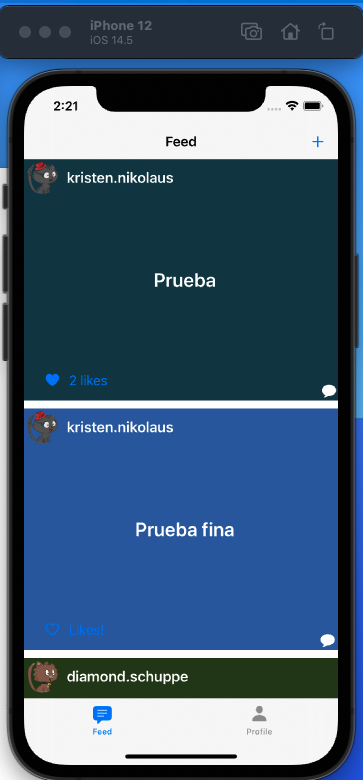

# Secretly

## General Description

This is a intermediate project of the IO's Applications Diploma.

The original implementation app is from Luis Ezcurdia and this is the link: https://github.com/iOSLabUNAM/secretly

## My Implementation

My implementation is very simple, i implemented the like Button to post.

### Files Changed/Created

#### Models

- Secretly/Models/Like.swift
- Secretly/Models/Post.swift

#### Network

- Secretly/Network/HttpResponse.swift
- Secretly/Network/RestClient.swift

#### Services

- Secretly/Services/LikeService.swift

#### Views

- Secretly/Views/PostCollectionViewCell.swift
- Secretly/Views/PostCollectionViewCell.xib
- Secretly/Views/PreviewPostView.swift

### Videos/Photos

If you would like to see my implementation, you can found in this video:

**https://drive.google.com/file/d/163rqM2DQBxlpWhbHunrz1oNNwik1Hqgg/view?usp=sharing**

