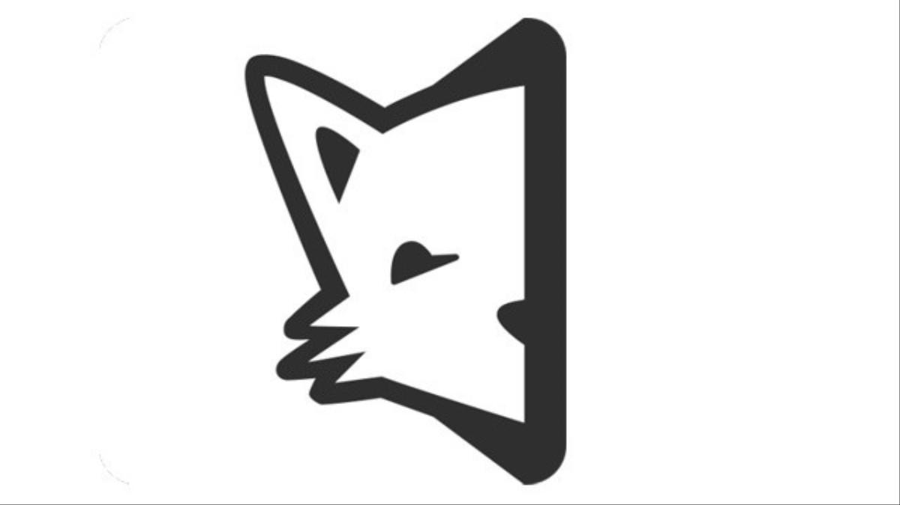
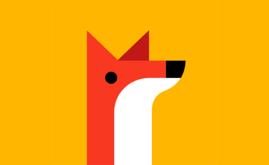

# Secretly

Secretly es una aplicación inspirada en Secret App, lanzada en 2014 y cerrada en 2015 por toda la polémica que hubo detrás de ella.

Esta implementación se hace con fines meramente académicos y con el objetivo de analizar cómo implementar algunos de los features que la aplicación tenía.

## Live demo

## MVP

Revisa nuestro "mínimo producto viable" [aquí](https://github.com/iOSLabUNAM/secretly/projects/1)

## Other

Otros logotipos la aplicación

